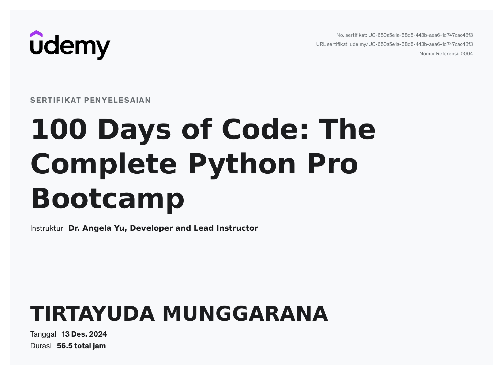

# Data Analytics & Python Developer

## Education
- Banchelor Degree of Engineering | Telkom University (_December 2024)

## Organization
### Asisstant Laboratory @ Everything Connected
- Teaching practicums for networking and data and
cloud computing courses
- Create a Moodle-based online learning website for
lab purposes
- Create internal laboratory events, such as study Group

## Work Experience
### IT Support @ Badan Riset dan Inovasi Nasional 
- Monitored and performed maintenance on the
network infrastructure to ensure optimal
performance and stability.
- Installed network systems on the newly renovated
floor, ensuring seamless connectivity and
functionality.
- Performed routine maintenance and
troubleshooting on BRIN staff computers to ensure
smooth operation and minimize downtime.

## Projects

## Certification
### 100 Days Python Certification @ Udemy

